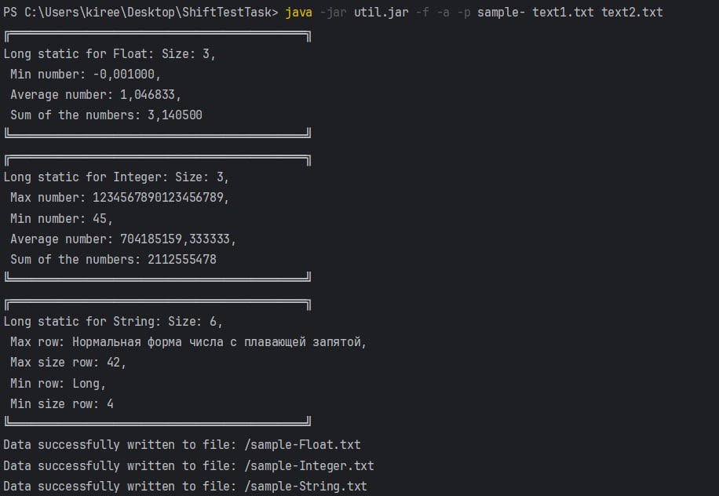
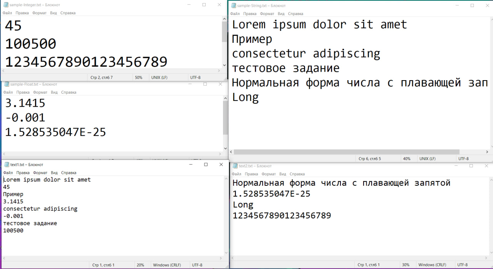
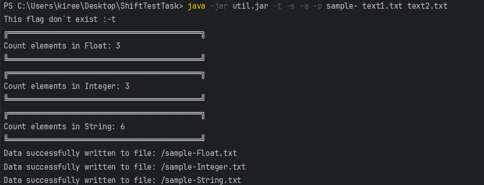
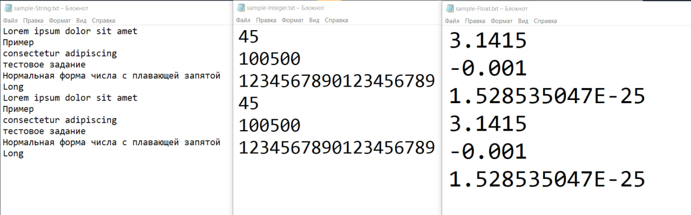
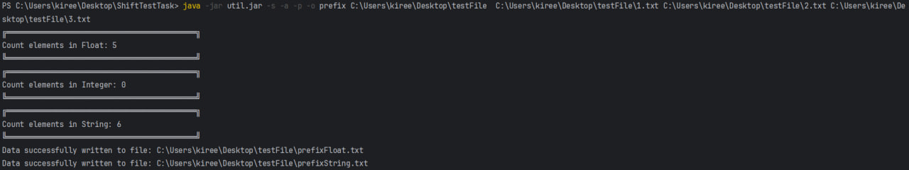
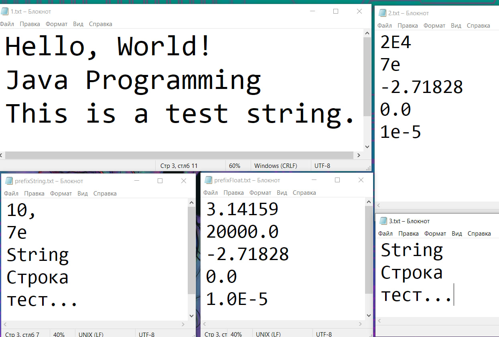
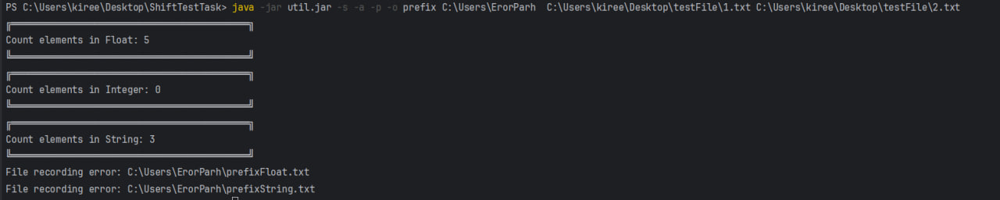
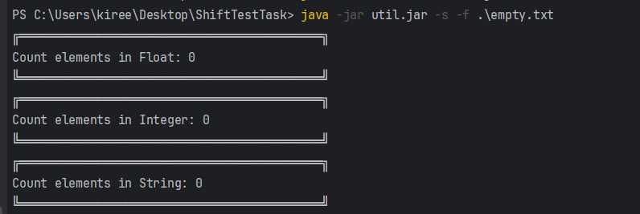

# Тестовое задание
### Создание инструмента для фильтрации данных в файлах по типу данных.

Считывание данных построчно из файлов. Запись каждого значения по их типу Integer, Float, String.   
- `Integer` (все положительные и отрицательные числа без запятой в диапазоне от -2^63 до 2^63-1.    
- `Float` (все положительные и отрицательные числа с запятой или точкой, а также E(e), диапазоне от -2^1024 до 2^1024-1.  
- `String` (все остальные строки).

### Флаги, возможные функции:
`-o` добавить путь куда будут сохраняться файлы   
`-p` добавляет префикс для вывода файлов    
`-a` режим добавления в существующие файлы (новые данные не будут переписывать старые)  
`-s` краткая статистика по полученным данным    
`-f` полная статистика по полученным данным

#### Примечание
Путь для сохранения и префикс задаются **после** написание всех флагов.
Запись файлов для чтения задается в последнюю очередь.

### Инструкция по запуску
### Необходимое окружение
- Версия Java: 23.0.1.
### Шаги для запуска
1.  **[Скачайте](https://github.com/t2t2t2t/ShiftTestTask/releases/download/v1/util.jar)** `util.jar`.
2. Откройте командную строку.
3. Из папки с файлом запустите программу с помощью следующей команды:
    ```
    java -jar util.jar указать нужные флаги и путь для чтения файлов  
    ```

### Устройство кода
`Main` 
- запускает обработку аргументов
- чтение из файлов 
- обработку данных из файла
- запуск функции статистики
- запись в файл с проверкой на существование файла 

`DataClass` — абстрактный класс для `Integer`, `Float`, `String`. В абстрактном классе реализована список для дальнейшей работы с данными и запись файлов.
В классах `DataInteger`, `DataFloat`, `DataString` реализована подсчет статистика данных с использованием стримов.  
`DataManage` и `DataArgumentParser` — синглтон-классы, которые хранят в себе единственные экземпляры классов типов данных и аргументов функции, соответственно.  
`ArgumentParser`- обрабатывает аргументы, а также запускает определённых функций, если флаг с данным параметром был использован.  
`ReadFile`- читает данные из файлов.  
В утилите используются BufferedWriter и BufferedReader для более эффективного чтения и запись файлов за счет буферизации.  
Для определения типов данных используются регулярные выражения.


### Примеры запуска
### Тест 1
```
java -jar util.jar -f -a -p sample- text1.txt text2.txt
```




### Тест 2
```
java -jar util.jar -t -s -a -p sample- text1.txt text2.txt
```



- в те же файлы добавились новые значения 
- статистика изменилась
- флаг, которого не существует, помечен как не существующий
### Тест 3
```
java -jar util.jar -s -a -p -o prefix C:\Users\kiree\Desktop\testFile  C:\Users\kiree\Desktop\testFile\1.txt C:\Users\kiree\Desktop\testFile\2.txt C:\Users\kiree\Desktop\testFile\3.txt
```



- пути указаны абсолютно
- файл prefixInteger.txt не создан, т.к. нет данных этого типа

### Тест 4
```
java -jar util.jar -s -a -p -o prefix C:\Users\ErorParh  C:\Users\kiree\Desktop\testFile\1.txt C:\Users\kiree\Desktop\testFile\2.txt
```


- выходные файлы не записаны, т.к. путь указан неправильно
### Тест 5
```java -jar util.jar -s -f .\empty.txt```

- файл пустой, полной статистики нет, записи данных нет

### Создать jar файл из кода
```
javac -d bin src/Main.java src/data/*.java
jar cmf manifest.txt util.jar -C bin/ .

#например 
java -jar util.jar -s text1.txt
```